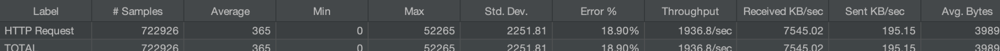
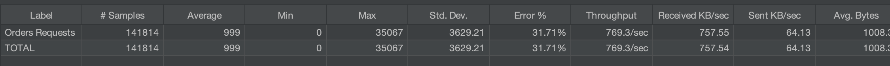

# Performance Tuning and Optimization Report

## API Load Testing Results

### Endpoint: `/api/products/`

- **Number of Samples:** 722,926 requests
- **Average Response Time:** 365 ms
- **Error Rate:** 18.90%
- **Throughput:** 1936.8 requests/second
- **Received KB/sec:** 7545.02 KB/sec
- **Sent KB/sec:** 195.15 KB/sec

#### Observations:
- The endpoint demonstrates reasonable response times but suffers from a high error rate under load.
- The high throughput shows the server can handle significant traffic, but the error rate suggests it is reaching its performance limit.
- Large payload sizes are likely causing high network utilization.

### Endpoint: `/api/orders/`

- **Number of Samples:** 141,814 requests
- **Average Response Time:** 999 ms
- **Error Rate:** 31.71%
- **Throughput:** 769.3 requests/second
- **Received KB/sec:** 757.55 KB/sec
- **Sent KB/sec:** 64.13 KB/sec

#### Observations:
- This endpoint exhibits a slower response time compared to `/api/products/`. The reason would be that cache is implemented to `/api/products/`
- A very high error rate indicates critical performance issues.
- Payload sizes are smaller than `/api/products/`, suggesting the bottleneck may lie in database operations or business logic.
