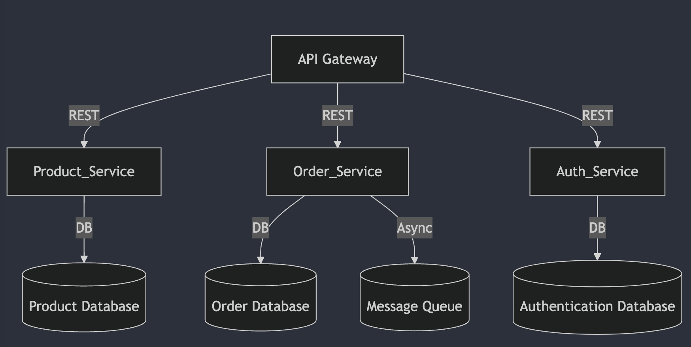

# Scaling Strategies with Sharding and Microservices

## Overview
Scaling an application to handle high loads and increasing demands is a critical aspect of modern software architecture. This document discusses opportunities for sharding and transitioning to microservices, focusing on key features like product management and order processing.

---

## Identifying Opportunities for Sharding

Sharding involves splitting a database into smaller, more manageable pieces (shards). Each shard handles a subset of the data, reducing the load on individual nodes and improving scalability.

### Use Cases for Sharding

1. **User Data**:
   - **Sharding Key**: User ID.
   - **Rationale**: Distribute user records across multiple shards to avoid bottlenecks on a single database instance.

2. **Order Data**:
   - **Sharding Key**: Order ID or User ID.
   - **Rationale**: Order records can grow rapidly. Sharding ensures efficient read and write operations.

3. **Product Catalog**:
   - **Sharding Key**: Category ID.
   - **Rationale**: Products within a category can be grouped and distributed, enabling efficient queries by category.

### Implementation Plan

- Use a database that supports horizontal sharding, such as MongoDB or CockroachDB.
- Configure application logic to determine the appropriate shard for each query based on the sharding key.
- Implement shard-aware connection pools to optimize performance.

---

## Transitioning to Microservices

Microservices architecture divides a monolithic application into smaller, independently deployable services. This enables better scalability, fault isolation, and development agility.

### Key Features to Transition

1. **Product Management**
   - **Service**: "Product Service"
   - **Responsibilities**:
     - Manage product catalog (CRUD operations).
     - Handle product categorization and inventory updates.
   - **Technology**: Django REST Framework for APIs, backed by a scalable database.

2. **Order Processing**
   - **Service**: "Order Service"
   - **Responsibilities**:
     - Manage order creation, updates, and tracking.
     - Integrate with payment gateways.
   - **Technology**: FastAPI for lightweight performance and async capabilities.

3. **User Authentication**
   - **Service**: "Auth Service"
   - **Responsibilities**:
     - User registration and login.
     - Token-based authentication (e.g., JWT).
   - **Technology**: Django with built-in authentication modules.

### Architecture Plan

- **API Gateway**:
  - Acts as a single entry point for clients, routing requests to the appropriate microservices.
  - Handles cross-cutting concerns like authentication and rate limiting.

- **Communication**:
  - Use REST APIs for synchronous communication between services.
  - Implement message queues (e.g., RabbitMQ or Kafka) for asynchronous tasks.

- **Database Strategy**:
  - Each service owns its database, ensuring clear data boundaries.
  - Use shared databases only when necessary (e.g., analytics).

---

## Architecture Diagram



---

## Code Examples

### Sharding Logic Example
```python
# Database sharding logic
class ShardRouter:
    def db_for_read(self, model, **hints):
        """Directs read operations to the appropriate shard."""
        if model._meta.app_label == 'orders':
            shard_key = hints.get('user_id') % NUM_SHARDS
            return f'shard_{shard_key}'
        return 'default'

    def db_for_write(self, model, **hints):
        """Directs write operations to the appropriate shard."""
        if model._meta.app_label == 'orders':
            shard_key = hints.get('user_id') % NUM_SHARDS
            return f'shard_{shard_key}'
        return 'default'
```

### Microservices Example (Order Service)
```python
from fastapi import FastAPI
from pydantic import BaseModel

app = FastAPI()

class Order(BaseModel):
    user_id: int
    product_ids: list[int]
    total_amount: float

@app.post("/orders/")
async def create_order(order: Order):
    # Process order creation
    return {"message": "Order created successfully", "order": order.dict()}
```

---

## Monitoring and Observability

1. **Distributed Tracing**:
   - Use tools like Jaeger or Zipkin to trace requests across services.

2. **Logging**:
   - Implement structured logging for each service with correlation IDs.

3. **Metrics**:
   - Expose Prometheus metrics for each service.
   - Use Grafana for visualizing metrics and monitoring performance.

